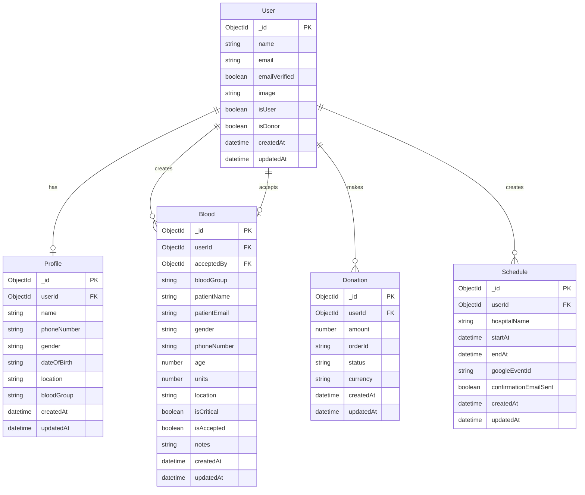
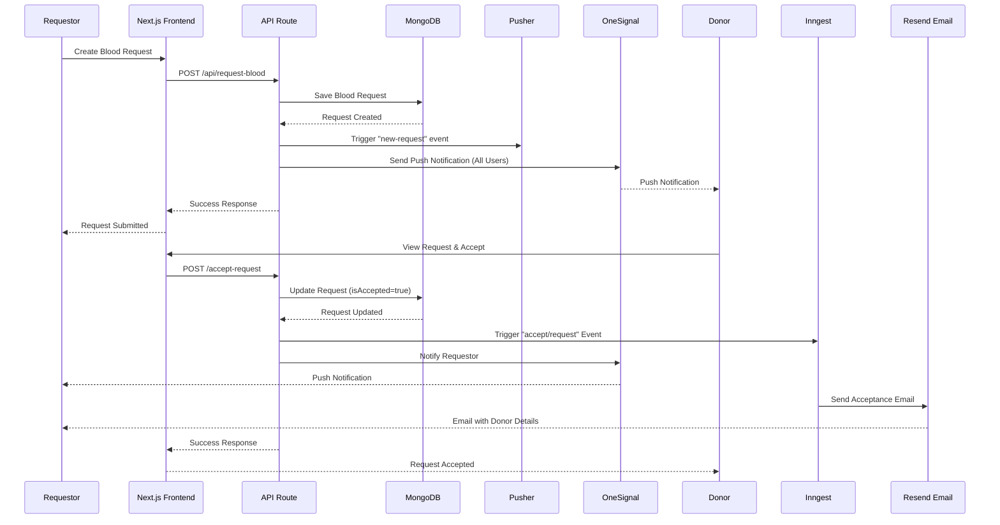

# RaktaXetu 🩸

**Connecting lives through blood donation**

RaktaXetu is a comprehensive blood donation platform that connects donors with those in need. The platform facilitates blood requests, donor discovery, real-time communication, and AI-powered assistance to make blood donation more accessible and efficient.

## 🌟 Features

### Core Features

- **🩸 Blood Request Management**
  - Create and manage blood requests with detailed patient information
  - Mark requests as critical for urgent cases
  - Track request status (pending/accepted)
  - View and manage your own blood requests

- **👥 Donor Discovery**
  - AI-powered vector search to find compatible donors
  - Filter donors by blood group, location, and other criteria
  - Send direct requests to potential donors
  - View donor profiles with contact information

- **💬 Real-Time Communication**
  - Live chat functionality using Stream Chat
  - Real-time messaging between donors and requestors
  - Channel-based communication system
  - Push notifications for new messages

- **🤖 AI Assistant**
  - Powered by Google Gemini 2.5 Flash
  - Web search integration for finding blood banks and donation centers
  - Educational guidance about blood donation
  - Eligibility and safety information
  - Rate limiting with Arcjet for API protection

- **📅 Donation Scheduling**
  - Schedule blood donation appointments
  - Google Calendar integration
  - Automated email confirmations
  - Hospital and time slot management

- **💰 Donation Support**
  - Financial donations via Razorpay integration
  - Track donation history
  - Support the platform's operations

- **🔔 Push Notifications**
  - OneSignal integration for cross-platform notifications
  - Real-time alerts for blood requests
  - Notification for request acceptance
  - Personalized user notifications

- **📧 Email Notifications**
  - Automated email system using Resend
  - Request acceptance notifications
  - Donation confirmations
  - Event scheduling emails

- **🔐 Authentication & Security**
  - Better Auth with Google OAuth
  - Secure session management
  - User profile management
  - Protected API routes

## 🛠️ Technologies Used

### Frontend
- **Next.js 15.5.4** - React framework with App Router
- **React 19.1.0** - UI library
- **TypeScript** - Type-safe development
- **Tailwind CSS 4** - Utility-first CSS framework
- **Radix UI** - Accessible component primitives
- **Framer Motion** - Animation library
- **React Hook Form** - Form management
- **Zod** - Schema validation
- **TanStack Query** - Data fetching and caching
- **Zustand** - State management

### Backend & Database
- **MongoDB** - NoSQL database
- **Mongoose 8.18.2** - MongoDB object modeling
- **Better Auth 1.3.18** - Authentication framework
- **Next.js API Routes** - Serverless API endpoints

### AI & Machine Learning
- **Google Gemini 2.5 Flash** - AI model for chatbot
- **Pinecone** - Vector database for semantic search
- **Exa JS** - Web search API integration
- **AI SDK** - Vercel AI SDK for streaming responses

### Real-Time & Communication
- **Stream Chat** - Chat infrastructure
- **Pusher** - Real-time event broadcasting
- **OneSignal** - Push notification service

### Background Jobs & Email
- **Inngest** - Background job processing
- **Resend** - Transactional email service
- **React Email** - Email template components

### Payment & Integrations
- **Razorpay** - Payment gateway
- **Google APIs** - Calendar integration
- **Google OAuth** - Social authentication

### Monitoring & Analytics
- **Sentry** - Error tracking and monitoring
- **Vercel Analytics** - Web analytics
- **Vercel Speed Insights** - Performance monitoring
- **Arcjet** - Rate limiting and security

### Development Tools
- **ESLint** - Code linting
- **Turbopack** - Fast bundler
- **TypeScript** - Type checking

## 📊 Database Schema (ER Diagram)



## 🔄 Blood Request Flow (Sequence Diagram)



## 🚀 Getting Started

### Prerequisites

- Node.js 18+ and npm/yarn/pnpm/bun
- MongoDB database
- Google OAuth credentials
- Various API keys (see Environment Variables)

### Installation

1. **Clone the repository**
   ```bash
   git clone <repository-url>
   cd rakta-xetu
   ```

2. **Install dependencies**
   ```bash
   npm install
   # or
   yarn install
   # or
   pnpm install
   # or
   bun install
   ```

3. **Set up environment variables**
   
   Create a `.env.local` file in the root directory with the following variables:
   ```env
   # Database
   DATABASE_URL=your_mongodb_connection_string
   
   # Authentication
   BETTER_AUTH_SECRET=your_auth_secret
   BETTER_AUTH_URL=http://localhost:3000
   GOOGLE_CLIENT_ID=your_google_client_id
   GOOGLE_CLIENT_SECRET=your_google_client_secret
   
   # AI & Search
   GOOGLE_GENERATIVE_AI_API_KEY=your_gemini_api_key
   PINECONE_API_KEY=your_pinecone_api_key
   PINECONE_INDEX_NAME=your_index_name
   EXA_API_KEY=your_exa_api_key
   
   # Real-time & Notifications
   PUSHER_APP_ID=your_pusher_app_id
   PUSHER_KEY=your_pusher_key
   PUSHER_SECRET=your_pusher_secret
   PUSHER_CLUSTER=your_pusher_cluster
   ONESIGNAL_APP_ID=your_onesignal_app_id
   ONESIGNAL_REST_API_KEY=your_onesignal_api_key
   
   # Chat
   STREAM_API_KEY=your_stream_api_key
   STREAM_API_SECRET=your_stream_api_secret
   
   # Email
   RESEND_API_KEY=your_resend_api_key
   SMTP_DOMAIN=your_smtp_domain
   
   # Background Jobs
   INNGEST_EVENT_KEY=your_inngest_event_key
   INNGEST_SIGNING_KEY=your_inngest_signing_key
   
   # Payment
   RAZORPAY_KEY_ID=your_razorpay_key_id
   RAZORPAY_KEY_SECRET=your_razorpay_key_secret
   
   # Monitoring
   SENTRY_DSN=your_sentry_dsn
   ARCJET_KEY=your_arcjet_key
   ```

4. **Run the development server**
   ```bash
   npm run dev
   # or
   yarn dev
   # or
   pnpm dev
   # or
   bun dev
   ```

5. **Open your browser**
   
   Navigate to [http://localhost:3000](http://localhost:3000)

### Building for Production

```bash
npm run build
npm start
```

## 📁 Project Structure

```
rakta-xetu/
├── src/
│   ├── app/                    # Next.js App Router
│   │   ├── (auth)/            # Authentication routes
│   │   ├── (public)/          # Public pages
│   │   ├── (root)/            # Protected routes
│   │   │   └── (routes)/      # Main application routes
│   │   │       ├── chat/      # Chat functionality
│   │   │       ├── chatbot/   # AI assistant
│   │   │       ├── find-donors/ # Donor search
│   │   │       ├── request-blood/ # Blood requests
│   │   │       └── donate-us/ # Financial donations
│   │   └── api/               # API routes
│   │       ├── auth/          # Authentication endpoints
│   │       ├── chat/          # AI chat endpoint
│   │       └── inngest/       # Background jobs
│   ├── components/            # React components
│   │   ├── modules/           # Feature modules
│   │   ├── ui/                # UI components
│   │   ├── auth/              # Auth components
│   │   └── emails/            # Email templates
│   ├── db/                    # Database models
│   │   └── models/            # Mongoose schemas
│   ├── hooks/                 # Custom React hooks
│   ├── lib/                   # Utility libraries
│   ├── server/                # Server actions
│   ├── tools/                 # AI tools
│   ├── vector/                # Vector search
│   ├── inngest/               # Background job functions
│   └── styles/                # Global styles
├── public/                     # Static assets
├── types/                      # TypeScript type definitions
└── package.json
```

## 🔒 Security Features

- **Rate Limiting**: Arcjet integration for API protection
- **Authentication**: Secure session management with Better Auth
- **Input Validation**: Zod schemas for data validation
- **Error Tracking**: Sentry for monitoring and debugging
- **Secure API Routes**: Protected endpoints with authentication checks

## 🤝 Contributing

Contributions are welcome! Please feel free to submit a Pull Request.

## 📝 License

This project is private and proprietary.

## 📞 Contact & Support

- **Website**: [RaktaXetu](https://raktaxetu.com)
- **Instagram**: [@raktaxetu](https://www.instagram.com/raktaxetu)
- **Twitter/X**: [@raktaxetu](https://x.com/raktaxetu)
- **LinkedIn**: [Rakta Xetu](https://www.linkedin.com/in/rakta-xetu-bab891389)
- **Threads**: [@raktaxetu](https://www.threads.com/@raktaxetu)

---

**Made with ❤️ for saving lives**

