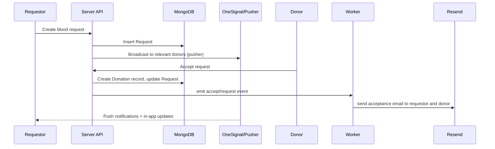
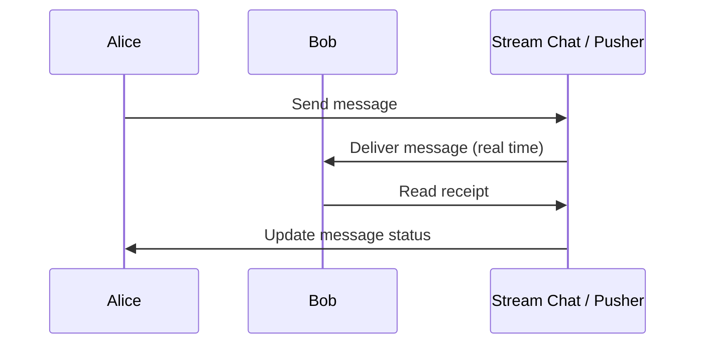

# RaktaXetu — Donate & Request Blood with Confidence

RaktaXetu is a production‑ready, privacy‑minded platform for coordinating blood donations and requests. It connects people in need with volunteers and hospitals, provides real‑time chat and notifications, lets donors schedule and track donations, and includes analytics and safety workflows to ensure trust and traceability.

---

## 🚀 Product Vision

RaktaXetu's mission is to make community blood donation and request matching fast, reliable, and humane. It's designed for NGOs, hospitals, and community organizers, focusing on safety, privacy, and usability.

---

## ✅ Key Features

- User onboarding and profile management (donor availability, blood group, location)
- Create, search, and manage blood requests
- Accept / commit to a request and confirm donations
- Real‑time chat and presence for requestors & donors (Pusher / Stream)
- Notifications via OneSignal and in‑app alerts
- Donation scheduling with Google Calendar integration
- Payment/donation flow (Razorpay integration for donation drives)
- Transactional emails (Resend) for confirmations and receipts
- Analytics and charts for donations, requests, and KPIs
- AI‑assisted tools: search, transcription, and assistant features (optional) using AI SDKs and vector search (Pinecone)
- Background events and automation via Inngest for email and workflow triggers
- Sentry telemetry and observability for production errors
- Safety and validation via Zod schemas and server‑side checks

---

## 🧭 High Level Architecture

- Frontend: Next.js (App Router), React 19, Tailwind CSS
- Backend: Next.js API routes + server functions, MongoDB (Mongoose), Inngest functions for background jobs
- Realtime: Pusher / Stream Chat for live messages and presence
- Search & AI: Pinecone vector store + AI SDKs for semantic search and assistant features
- Payments: Razorpay for donation payments
- Notifications & Emails: OneSignal (web push) and Resend for emails
- Telemetry: Sentry for server and edge instrumentation

---

## 📁 Project Structure

- `src/app` — Top‑level pages & routes
- `src/components` — UI components & module pages (requests, donations, chat, schedule, profile)
- `src/db` — Mongoose models and db connection
- `src/server` — Server actions, services and API helpers
- `src/inngest` — Background functions (send emails, daily jobs)
- `src/lib` — Helpers (audio, auth, utils)
- `src/vector` — Pinecone integration and vector services

---

## 💻 Tech Stack

- Next.js (App Router), React 19, TypeScript
- Tailwind CSS, Framer Motion, Radix UI primitives
- MongoDB + Mongoose
- Pusher / Stream Chat for real‑time communications
- Pinecone for vector search and AI similarity
- AI SDKs (OpenAI/ai or provider SDKs), Google APIs for calendar integration
- Inngest for background jobs and event orchestration
- Sentry for monitoring
- Resend for email delivery

---

## 🧩 Data Model (Simplified)

Below is a simplified ER diagram capturing primary entities: Users, Requests (blood), Donations, Messages, Schedule events, Payments. See `docs/ARCHITECTURE.md` for a larger diagram.

```mermaid
erDiagram
    USERS ||--o{ REQUESTS : "creates"
    USERS ||--o{ DONATIONS : "donates"
    REQUESTS ||--o{ DONATIONS : "fulfilled_by"
    USERS ||--o{ MESSAGES : "writes"
    REQUESTS ||--o{ MESSAGES : "has"
    USERS ||--o{ EVENTS : "schedules"
    DONATIONS }o--|| PAYMENTS : "may_have"

    USERS {
      ObjectId _id
      string name
      string email
      string phone
      string bloodGroup
      boolean availableForDonation
    }
    REQUESTS {
      ObjectId _id
      string patientName
      string bloodGroup
      number units
      string status
      date createdAt
    }
    DONATIONS {
      ObjectId _id
      ObjectId donorId
      ObjectId requestId
      string status
      date scheduledAt
    }
    MESSAGES {
      ObjectId _id
      ObjectId conversationId
      ObjectId senderId
      string text
      date createdAt
    }
    EVENTS {
      ObjectId _id
      ObjectId userId
      string title
      date start
      date end
    }
    PAYMENTS {
      ObjectId _id
      ObjectId donationId
      string provider (razorpay)
      string status
      number amount
    }
```

---

## 🔁 Typical Flows (Sequence Examples)

### Request → Donor → Acceptance → Email



### Chat Flow (Real‑time)



---

## 🧪 Getting Started (Local Dev)

1. Clone the repo
2. Copy `.env.example` to `.env` and fill in credentials (MongoDB URI, PINCONE key, RAZORPAY keys, RESEND key, SENTRY DSN, ONE_SIGNAL, Pusher keys)
3. Install dependencies: `pnpm install` (or npm/yarn)
4. Run dev: `pnpm dev` (Next.js dev server)
5. Run background workers locally (Inngest dev or configure your event runner)

> Important: For Google Calendar scheduling, enable Google OAuth and add the required scopes (calendar). See `src/components/modules/schedule/*` for the current integration.

---

## 🛡 Security & Best Practices

- Validate and sanitize all user inputs server‑side with Zod and Mongoose validators.
- Do not store sensitive keys in code; use environment variables and secret storage in production.
- Use Sentry for error reporting and set sampling appropriately.

---

## 📦 Deployment

- Build: `pnpm build`
- Start: `pnpm start`
- Recommended: Deploy to Vercel for edge functions and incremental static advantages. Ensure environment variables in platform settings and set up background job runner for Inngest and webhook endpoints for payment/notification callbacks.

---

## 👩‍💻 Contributing

Contributions are welcome. Please open issues for feature requests or bugs. Pull requests should include tests where reasonable and a short description in the PR explaining the change.

---

## 📞 Contact & Support

For implementation questions or enterprise integration, open an issue or reach out to the maintainer (see `package.json`).

---

Thank you for using RaktaXetu ❤️
