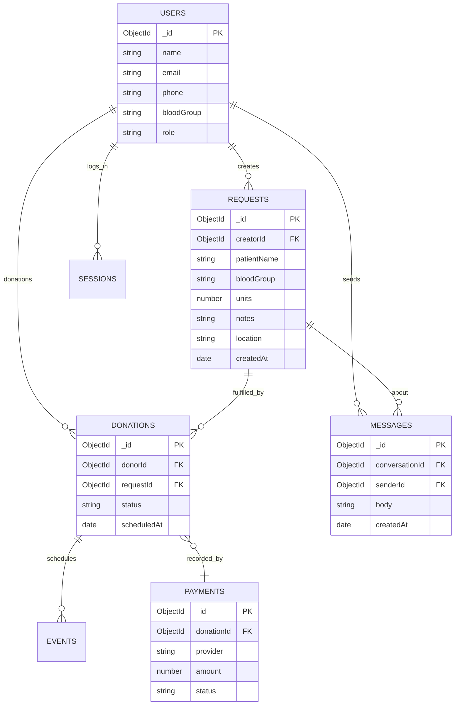
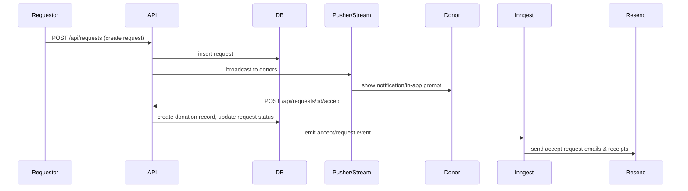
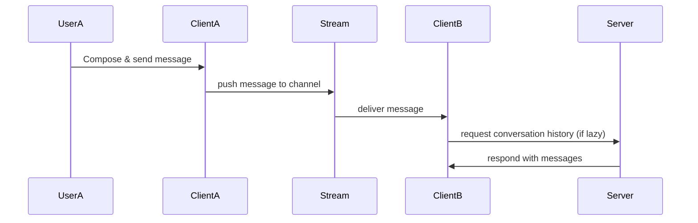

# Architecture & Diagrams — RaktaXetu

This document describes the architecture, key services, data model, and sequence diagrams for core flows.

---

## 📌 Overview

RaktaXetu is built as a modern server/client system using Next.js for front and server code, MongoDB for data persistence, Pusher/Stream for real‑time interactions, Pinecone for vector search, and Inngest for event orchestration.

---

## 🧠 Components & Responsibilities

- Frontend (Next.js App Router)
  - Pages & UI modules (requests, donors, donations, chat, profile, schedule)
  - Client SDKs: Pusher/Stream, OneSignal, Google APIs, Razorpay frontend SDK
- Backend / Server
  - REST-like routes & server actions (Next API or route handlers)
  - Mongoose models and MongoDB for persistence
  - Inngest functions: asynchronous workflows (emails, health checks, scheduled tasks)
- Integrations
  - Pinecone: vector index for semantic search and AI features
  - Resend: transactional email delivery (templates located in `src/components/emails`)
  - Razorpay: donation payments
  - Google Calendar: scheduling and reminders
  - Sentry: error & performance monitoring

---

## 🔗 Environment Variables (examples)

- `MONGODB_URI` — MongoDB connection string
- `PINECONE_API_KEY`, `PINECONE_INDEX` — Pinecone vector access
- `RAZORPAY_KEY_ID`, `RAZORPAY_KEY_SECRET` — Payments
- `RESEND_API_KEY` — Email delivery
- `ONE_SIGNAL_APP_ID`, `ONE_SIGNAL_API_KEY` — Web push
- `SENTRY_DSN` — Error monitoring
- `NEXT_PUBLIC_*` — Client‑exposed keys when needed

> Always keep these out of version control.

---

## 🗂 Data Model Notes

Primary models are implemented under `src/db/models` and typed in `types/schema.d.ts`. Important domain fields:

- Request (blood): patient details, blood group, units, location, contact, status (open / matched / closed)
- Donation: donor id, request id, status (pending, paid, fulfilled), scheduled time
- User: profile, blood group, verified contact details, donation settings
- Message / Conversation: chat messages, attachments, audio
- Event: scheduled calendar entries

---

## 🔍 ER Diagram (Detailed)

---

## 🔁 Sequence Diagrams (Core flows)

### Request lifecycle (user → donor → acceptance → automation)

### Chat & Real‑time messages

---

## 🛠 Developer Notes & Conventions

- Use `zod` for request validation and `mongoose` for persistence models.
- Keep presentation separate from domain logic; `src/server` and `src/lib` contain most service logic.
- Background workflows use Inngest; model offline or long running processes as events.
- Use `src/components/emails/*` for email templates — composed with React for consistency.

---

## ✅ Deployment Checklist

- [ ] Add production DB and secret store
- [ ] Configure Web Push, Mailer, and Payment webhooks
- [ ] Set Sentry DSN with proper environment
- [ ] Run DB migrations (if applicable) or data validation scripts

---

If you want, I can add sequence diagrams for other flows (payments, scheduling calendar invites, AI assistant) or expand to include a complete API reference and swagger spec.
